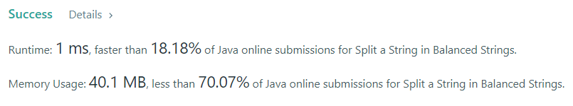

# Split a String in Balanced Strings

### Task:

Balanced strings are those that have an equal quantity of 'L' and 'R' characters.
Given a balanced string s, split it into some number of substrings such that:
Each substring is balanced.
Return the maximum number of balanced strings you can obtain.

### Example 1:

Input: s = "RLRRLLRLRL"
Output: 4
Explanation: s can be split into "RL", "RRLL", "RL", "RL", each substring contains same number of 'L' and 'R'.

### Result:

The time complexity of this algorithm is O(N). And the same algorithm for memory.
